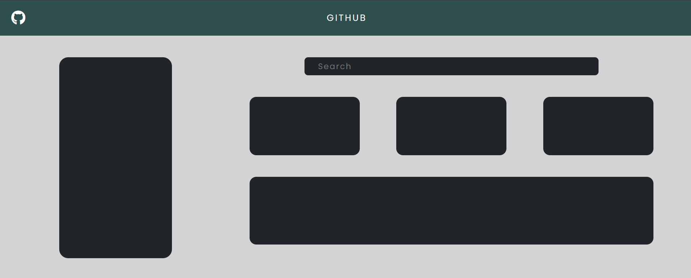

# GitHub Profile Page Layout

A responsive layout for a GitHub profile page using HTML, CSS, and Bootstrap.



- **Features:**
  - Responsive design with Bootstrap grid system.
  - Custom CSS for modern styling.
  - Header with navigation bar and main content layout.

- **Technologies Used:**
  - HTML
  - CSS
  - Bootstrap

---

**Conclusion:**

This project showcases a basic GitHub profile page layout created with HTML, CSS, and Bootstrap.

Thank you for checking out this project! If you have any suggestions or feedback, feel free to reach me:

**Mail ID:** 
```bash
rajkumaranbu192@gmail.com
